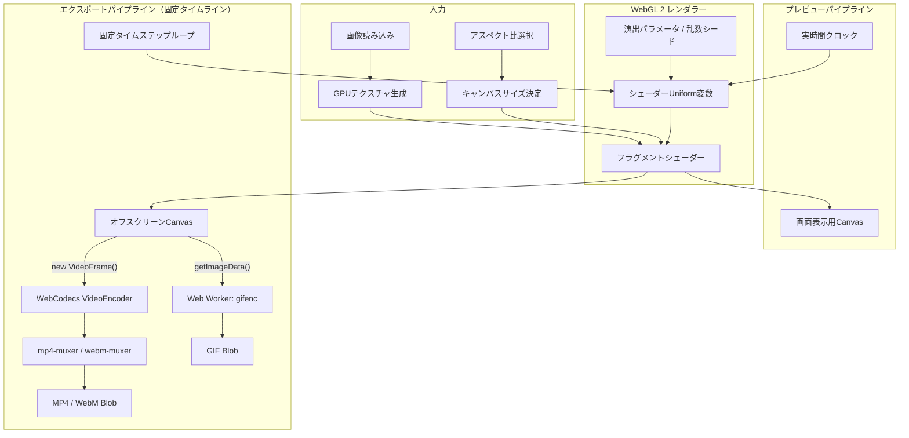
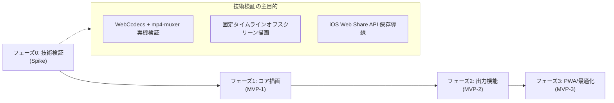

# App Reveal Lab 要件定義書

| 項目 | 内容 |
|---|---|
| 文書バージョン | 0.2 |
| ステータス | 要件定義（改訂版） |
| 対象 | MVP |
| 想定プラットフォーム | PC・スマートフォン向けWebアプリ／PWA |
| 最終更新日 | 2026-09-17 |

---

## 改訂履歴

| バージョン | 更新日 | 主な変更内容 |
|---|---|---|
| 0.1 | 2026-09-16 | 初版作成（MVPスコープ・基本演出・出力要件の定義） |
| 0.2 | 2026-09-17 | 精査結果の反映：<br>・出力アスペクト比プリセット（SNS最適化: 9:16, 1:1, 16:9等）の追加<br>・動画エンコード方式を「WebCodecs + Muxer」に具体化（GPUダイレクトフレーム処理）<br>・H.264偶数ピクセル（2の倍数）アライメント要件の追加<br>・GIF出力上限（解像度・fps・時間）の実用的な見直しとWeb Worker実行の明記<br>・WebGL 2専任化（Canvas 2Dフォールバックの除外・割り切り）<br>・iOS Safari / PWA環境でのWeb Share API優先保存導線の追加<br>・技術スタック選定の具体化（TypeScript, Vite, twgl.js, mp4-muxer, gifenc等） |

---

## 1. 概要

App Reveal Labは、1枚の画像を低解像度・モザイク状態から高解像度へ段階的に変化させる「プログレッシブ表示風」の画像トランジションを作成し、動画・アニメーション画像として出力できるWebアプリである。

本アプリにおける「プログレッシブ表示」は、ネットワーク上の画像読み込み過程そのものを再現するものではない。読み込み済み画像にWebGL 2／GLSLシェーダーエフェクトを適用し、意図した時間・順序・表現で画像が明瞭になる視覚演出をブラウザ内ローカル処理で生成する。

---

## 2. 背景と目的

### 2.1 背景

低解像度の像が徐々に明らかになる演出には、SNS投稿、ショート動画の導入、画像クイズ、ゲーム、プレゼンテーション、展示作品、Webサイトの演出など、幅広い用途がある。一方、既存の動画編集ソフトでは、同様の表現を作るために複数レイヤー、マスク、キーフレーム等の複雑な設定が必要となる。

### 2.2 目的

利用者が画像を選択し、出力サイズ（アスペクト比）や演出パターン、少数のパラメータを直感的に調整するだけで、プログレッシブ表示風トランジションを作成・確認・共有できる状態を実現する。

### 2.3 中心価値

> 画像を選ぶ、演出を調整する、結果を共有可能な形式で書き出す、という一連の操作をサーバーを介さずブラウザ内で完結させる。

---

## 3. 想定利用者

- SNS（TikTok, Instagram Reels, YouTube Shorts, X等）やチャットで短い画像演出を共有したい一般利用者・クリエイター
- Webサイトやプレゼンテーション用のトランジション素材を素早く試作したい制作者・デザイナー
- 画像クイズやゲームの演出素材を作りたいコンテンツ制作者
- WebGL／シェーダー表現をパラメータ調整しながら試したいテクニカルアート・ジェネラティブアート愛好者

---

## 4. 想定ユースケース

- SNS投稿・ショート動画（縦型 9:16、正方形 1:1、横型 16:9）の導入アイキャッチ演出
- LINEやチャットツールで共有する短いループアニメーション（GIF）
- 「何が写っているか」を段階的に見せる画像クイズ・告知演出
- ゲームの画像アンロック・解析完了・データロード演出
- プレゼンテーションや展示作品のトランジション素材作成
- Webサイトで利用する軽量動画素材（WebM / MP4）の作成

---

## 5. MVPのスコープ

### 5.1 MVPに含める機能

- 画像の読み込み（JPEG / PNG / WebP）
- 出力キャンバスのアスペクト比設定（元画像、9:16、1:1、16:9等）
- 画像配置の調整（`contain` / `cover`、位置パン、余白背景色）
- WebGL 2／GLSLによるリアルタイム描画（GPUテクスチャ処理）
- 6種類の基本演出
- 演出パラメータの調整（時間、イージング、境界ぼかし、ブロックサイズ等）
- 再生、一時停止、先頭移動、シーク、ループ、全画面表示
- 固定タイムラインによる高品質出力（MP4, GIF, WebM, PNG）
- WebCodecs + Muxerによる高速・省メモリな動画エンコード
- Web Share API対応（スマートフォンでのスムーズな保存・共有）
- 出力前のサイズ・時間・負荷に関する警告と制限
- プリセット保存（IndexedDB）
- 設定JSONのエクスポート／インポート
- 完全なブラウザ内ローカル処理（外部サーバー通信なし）
- レスポンシブUI対応（PC／スマートフォン両対応）
- PWA対応およびオフライン利用

### 5.2 MVPに含めない機能

- 複数画像や動画を並べるタイムライン・トラック編集
- 音声・効果音の編集（BGM付与等）
- テキストや図形、ウォーターマークのオーバーレイ合成
- ユーザーアカウント登録、クラウド保存、共有URL発行
- 複数端末間のリアルタイム同期
- ジャイロ、マイク音声、カメラ等とのリアルタイム連動
- 高度な動画編集、カット編集、トランジション連結
- サーバーサイドレンダリング

---

## 6. 機能要件

### 6.1 画像入力・キャンバス設定

#### FR-IMG-01 対応画像形式
- JPEG
- PNG
- WebP

#### FR-IMG-02 入力方法
- ファイル選択ダイアログ
- ドラッグ＆ドロップ（PC推奨）
- クリップボードからの画像貼り付け（Paste）
- アプリ内サンプル画像の選択（初回テスト用）

#### FR-IMG-03 出力アスペクト比と配置補正
- **出力アスペクト比プリセット**:
  - `元画像準拠` (Original)
  - `9:16` (TikTok / Instagram Reels / YouTube Shorts)
  - `1:1` (Instagram フィード / アイコン)
  - `16:9` (横型動画 / YouTube / X)
  - `4:5` (Instagram ポートレート)
- **フィット方式**:
  - `contain`（全体表示）：キャンバス内に画像全体を収め、余白部分には指定の背景色（既定: 黒 `#000000` または透明/任意色）を適用する。
  - `cover`（全画面フィット）：キャンバス全体を画像で満たし、はみ出た部分はトリミングする。
- **配置調整**: `cover` 使用時は、切り抜く中心位置（X/Yオフセット）をドラッグまたはスライダーで調整可能とする。
- **EXIF Orientation補正**: 撮影時の向き情報を読み取り、自動で正しい回転方向に補正する。

#### FR-IMG-04 入力時の安全策
- 非対応形式、破損ファイル、読み込み失敗時に分かりやすいエラーメッセージを表示する。
- 巨大画像（長辺4096px超など）は、GPUメモリ消費を抑えるため読み込み時に適切な作業解像度に自動リサイズするか警告する。
- 元画像を外部サーバーへ一切自動送信しない。

---

### 6.2 WebGL描画

#### FR-GL-01 描画方式（WebGL 2専任）
- 描画エンジンは **WebGL 2 (GLSL ES 3.00)** を必須とする。
- フルスクリーンクアッドに対してフラグメントシェーダーを適用し、元画像テクスチャ、モザイク計算、進行マスク、境界グラデーション、ブロックノイズをGPU上で合成する。
- 画像を再読み込み・再生成するのではなく、単一テクスチャのサンプリング座標計算（UV量子化・近傍サンプリング）と合成ブレンドによって解像状態をリアルタイム制御する。

#### FR-GL-02 描画の再現性
- 経過時間、正規化進行率（0.0〜1.0）、イージング関数、乱数シードから各フレームの描画状態を完全に決定論的に算出する。
- ランダム系演出は、同一のシード値と設定値から常に同一の描画結果を再現できる。
- プレビューと出力（エクスポート）で全く同一のシェーダープログラムおよび計算式を使用する。

#### FR-GL-03 座標とアスペクト比補正
- 円形マスク等の幾何学演出は、出力キャンバスのアスペクト比をユニフォーム変数としてシェーダーに渡し、縦長・横長キャンバスでも意図せず楕円にならないよう正円補正を行う。
- 演出位置や境界幅は、ピクセル単位ではなく正規化座標（0.0〜1.0）またはアスペクト比補正済みUV空間を基準として計算する。

#### FR-GL-04 障害対応と動作環境割り切り
- WebGLコンテキスト消失（`webglcontextlost`）を検知し、復旧時（`webglcontextrestored`）にテクスチャ・シェーダー・バッファを自動再生成して編集状態を復元する。
- **WebGL 2非対応環境への対応**:
  - WebGL 2が使用できない端末（普及率98%以上の範囲外）に対しては、サポート外である旨を明示する。
  - 描画速度・品質・保守性の観点から、**Canvas 2Dによるエフェクトフォールバックは実装しない**。

---

### 6.3 演出モード

| ID | モード名 | 概要・視覚効果 |
|---|---|---|
| **FR-FX-01** | **中心から外側へ (Radial Out)** | 中心から外側へ同心円状に高解像度領域が拡大。境界ぼかしにより滑らかなフォーカスイン効果。 |
| **FR-FX-02** | **外側から中心へ (Radial In)** | 画面外周から中心の被写体へ向けて高解像度化が収束。被写体を最後まで焦らす演出。 |
| **FR-FX-03** | **上から下へ (Linear Scan)** | 画面上部から下部へスキャンライン状に高解像度化。Web画像の古典的プログレッシブ描画を想起。 |
| **FR-FX-04** | **ブロックノイズスキャン (Block Scan)** | グリッド状に行単位で解像。境界付近に高解像度ブロックがランダムに先行出現するデジタルノイズ感。 |
| **FR-FX-05** | **ランダムブロック (Random Reveal)** | 画面全体をグリッド分割し、シード付き乱数順にブロックが個別に高解像度化。モザイクがパズル状に解ける演出。 |
| **FR-FX-06** | **多段階解像度 (Multi-Step LOD)** | 画像全体のモザイクが、超粗い状態から徐々に細かくなり、最後に元画像へシームレスに到達する演出。 |

---

### 6.4 調整パラメータ

#### 共通パラメータ
- **演出時間 (Duration)**: 1.0秒 〜 10.0秒（初期値: 3.0秒）
- **開始待機時間 (Start Delay)**: 0.0秒 〜 3.0秒（初期値: 0.5秒）
- **完成保持時間 (Hold Time)**: 0.0秒 〜 3.0秒（初期値: 1.0秒）
- **開始時モザイクサイズ**: 画面長辺に対する比率（粗さ）
- **終了時モザイクサイズ**: 最小値（元画像解像度 = 1px相当）
- **境界ぼかし幅 (Feather)**: 0.0（シャープ）〜 1.0（広域ぼかし）
- **イージング**: Linear, Ease-In, Ease-Out, Ease-In-Out, Cubic
- **ループ再生**: ON / OFF

#### ブロック系パラメータ（FR-FX-04, FR-FX-05）
- **グリッド分割数**: 横・縦のブロック数（例: 8x8, 16x16, 32x32, 64x64）
- **ブロック縦横比**: 正方形固定、またはキャンバス比率追従
- **ノイズ強度 / 先行表示率**: 境界より前方に解像ブロックが飛び出る確率
- **ランダムシード**: 整数値（シード変更ボタンでワンタップ更新可能）

#### 多段階解像度パラメータ（FR-FX-06）
- **段階数 (Steps)**: 3 〜 8段階
- **変化方式**: 階段状（Stepped）／ 連続フェード（Smooth）
- **各段階の保持比率**: 均等、または後半を長くするカーブ設定

#### パラメータUI
- 選択中の演出モードに関連するパラメータのみを動的に表示する。
- 「初期値に戻す（Reset）」ボタンを各演出ごとに配置。
- スライダー操作時にプレビューへ即時反映（シークバー位置に応じた描画更新）。

---

### 6.5 再生・プレビュー

- **操作機能**:
  - 再生 / 一時停止（トグルボタンおよびスペースキー）
  - 先頭へ戻る（Rewind）
  - ループ再生の有効/無効
  - シークバーによる任意時刻（タイムスタンプ）のスクラブ確認
  - 現在再生時間 / 総演出時間の表示（例: `01.2s / 04.5s`）
  - プレビュー全画面表示（フルスクリーン）
- **時間同期設計**:
  - プレビューの進行はフレーム数依存ではなく実時間経過（`performance.now()`）に基づき、描画落ちが発生しても演出全体の所要時間を正確に保つ。
  - 設定変更時は即座に現在シーク位置で再描画される。
  - 演出終了時点（および完成保持時間）において、最終フレームが必ず完全な元画像高解像度状態となることを保証する。

---

### 6.6 出力（エクスポート）

#### 6.6.1 出力形式の位置付け

| 形式 | コーデック / 方式 | 推奨用途 | 主な特徴 |
|---|---|---|---|
| **MP4** | H.264 (AVC) / AAC（無音）<br>`WebCodecs` + `mp4-muxer` | SNS・モバイル共有の標準 | 最も互換性が高く、iPhone・Android・各SNSで再生可能。ハードウェア支援により高速生成。 |
| **GIF** | 8bit Indexed Color<br>`gifenc` (Web Worker) | チャット・Web貼付・ドキュメント | 画像として手軽に貼り付け可能。無限ループ対応。 |
| **WebM** | VP9 or VP8<br>`WebCodecs` + `webm-muxer` | Webサイト埋め込み・PCブラウザ | 高画質・低容量。モダンWebでの動画背景や演出素材に最適。 |
| **PNG** | 静止画（Lossless） | サムネイル・素材・確認 | 完成状態の高解像度静止画キャプチャ。 |

#### FR-OUT-01 共通出力仕様
- **出力解像度**:
  - 設定されたアスペクト比に基づき、長辺基準で選択（720p相当, 1080p相当, またはカスタム）。
  - **重要（偶数ピクセル強制補正）**: H.264等のビデオコーデックの仕様に適合させるため、**出力キャンバスの幅・高さは常に偶数（2の倍数）に自動補正（切り捨て/調整）**する。
- **フレームレート (fps)**: 15, 24, 30, 60 fps から選択（形式に応じた推奨値を初期選択）。
- **推定ファイルサイズ表示**: 設定値（解像度・時間・fps）から概算ファイルサイズを事前提示。
- **進捗とキャンセル**: レンダリング中はパーセンテージプログレスバー、経過時間、および「中止（Cancel）」ボタンを表示。
- **出力結果プレビュー**: 生成完了後、モーダル内で再生確認およびファイルサイズ確認が可能。
- **保存・共有フロー**:
  - モバイル環境（iOS/Android）で `navigator.canShare({ files })` が利用可能な場合は、**Web Share API（システムの共有シート）**を呼び出し、写真アプリへの保存やSNSへの直接共有を優先する。
  - PCおよび非対応ブラウザでは、通常のファイルダウンロード（`a[download]`）を実行する。

#### FR-OUT-02 MP4出力（WebCodecs方式）
- **エンコードパイプライン**:
  - `WebCodecs VideoEncoder` を使用してブラウザのハードウェアエンコーダーを呼び出し、`mp4-muxer` によりMP4コンテナ（ISOBMFF）へ多重化する。
  - 固定タイムラインで1フレーム描画するごとに、GPU上のCanvasから直接 `new VideoFrame(canvas, { timestamp })` を生成してエンコーダーへ投入する（同期的な `readPixels` によるCPU転送ボトルネックを排除）。
- **初期値**: 長辺720p（1280x720相当）、30fps、ビットレート5〜8Mbps。
- **非対応環境対応**: WebCodecs非対応の古いブラウザでは、MP4出力が無効化され、WebMまたはGIFの利用、あるいは最新ブラウザへの移行を促すメッセージを表示する。

#### FR-OUT-03 GIF出力（最適化ストリーミング方式）
- **エンコードパイプライン**:
  - メインスレッドのフリーズを防ぐため、**Web Worker** 内で `gifenc` を用いてエンコードを実行する。
  - 全フレームの画像データをメモリに蓄積せず、1フレームごとにパレット量子化とフレーム書き込みを行うストリーミング方式を採用する。
- **ループ設定**: 無限ループ（既定）／ 1回再生 の切り替え。
- **初期値**: 長辺480px、15fps、無限ループ。

#### FR-OUT-04 WebM出力
- `WebCodecs VideoEncoder` (VP9/VP8) ＋ `webm-muxer` を使用して生成。
- 初期値: 長辺720p、30fps。

#### FR-OUT-05 固定タイムラインレンダリング（Fixed-Timestep）
- 出力処理時は実時間描画（`requestAnimationFrame`）を行わず、以下の一連のループで決定論的に生成する：
  1. 出力fpsに基づく刻み幅（`dt = 1 / fps`）で仮想時刻を進める。
  2. 対象フレームの時刻に合わせたシェーダー描画をオフスクリーンCanvasで実行する。
  3. 描画結果をエンコーダーへ投入する。
  4. 完了まで繰り返し、最終的にファイルを完成させる。
- これにより、端末スペックや処理負荷によるコマ落ち、音ズレ、カクつきを完全に排除する。

#### FR-OUT-06 出力パラメータ上限と安全制限

| 項目 | GIF | MP4 / WebM | 制限理由 |
|---|---:|---:|---|
| **最大長辺** | 480px (推奨) / 720px (上限) | 1920px (FullHD) | GIFの肥大化・メモリ枯渇防止 |
| **最大fps** | 15fps (推奨) / 30fps (上限) | 60fps | GIF量子化処理の負荷抑制 |
| **最大演出時間** | 5秒 (推奨) / 10秒 (上限) | 30秒 | モバイル端末でのOOMクラッシュ防止 |
| **最大総フレーム数** | 150 フレーム | 1,800 フレーム | ブラウザのタブ強制終了防止 |

- 上記の上限を超える設定の組み合わせ、または推定メモリ消費量が大きい場合は、設定画面上で**警告バッジ**を表示し、安全な設定への自動調整ボタンを提供する。

---

### 6.7 プリセット・設定保存

- **ローカルプリセット管理**:
  - 現在の演出パラメータ、キャンバス設定、色設定を名前付きプリセットとしてブラウザローカル（IndexedDB）に保存・呼び出し・上書き・削除できる。
  - 初期組み込みプリセット（例: 「SNSショート用スクエア」「シネマティックスキャン」「レトロゲーム風LOD」など）を提供する。
- **設定JSONのエクスポート／インポート**:
  - プリセット設定を `.json` ファイルとしてダウンロードおよび読み込み可能。
  - JSONにはフォーマットのバージョン番号（`schemaVersion: 1`）を含め、将来の拡張時も後方互換性を保つ。
  - **重要**: プライバシーとファイルサイズ肥大化防止のため、**元画像データはJSONに含めない**。

---

### 6.8 PWA・オフライン対応

- **Service Workerによるオフライン化**:
  - アプリのHTML/CSS/JS、シェーダーコード、Muxer/エンコーダーライブラリ、サンプル画像をキャッシュし、完全オフライン状態でアプリ起動から動画生成まで完結させる。
- **インストール対応**: Web App Manifestを定義し、デスクトップおよびモバイルでスタンドアロンアプリとしてインストール可能とする。
- **更新通知**: 新しいバージョンがデプロイされた場合、作業中の編集内容を破棄しないよう配慮しつつ、トースト通知で更新を案内する。

---

## 7. UI／UX要件

### 7.1 基本レイアウト設計
- **2ペイン構成（PC/タブレット）**:
  - 左側（または中央）: 大きなキャンバスプレビュー、再生コントロールバー。
  - 右側（またはサイドバー）: 
    1. 画像入力・キャンバス設定（アスペクト比選択）
    2. 演出モード切り替えタブ/カード
    3. 演出パラメータスライダー
    4. エクスポートパネル
- **1ペイン縦スクロール構成（スマートフォン）**:
  - 画面上部: プレビュー領域（スティッキー固定または上部優先配置）。
  - 画面下部: スワイプまたはタブで切り替え可能な設定・エクスポートパネル。

### 7.2 操作性・UX方針
- **3ステップで出力**: 「画像を選ぶ」→「演出/比率を選ぶ」→「出力ボタンを押す」だけで、デフォルト設定でも美しい成果物が得られるゼロコンフィグ設計。
- **リアルタイムスクラブ**: シークバーを動かした際、指やマウスの動きに追従してエフェクト状態が滑らかに変化すること。
- **非破壊編集**: 画像や演出モードを切り替えても、直前のパラメータ設定が保持されること。

### 7.3 アクセシビリティ・視覚刺激への配慮
- **キーボードショートカット**: Space（再生/停止）、←/→（コマ送り/シーク）、R（先頭に戻る）に対応。
- **Reduced Motion配慮**: OSの `prefers-reduced-motion` 設定が有効な場合、アプリ内UIアニメーションを抑制する。
- **光過敏性発作（Photosensitivity）への配慮**: 白黒の急激な明滅や高周波点滅を演出の初期値とせず、将来的なグリッチ演出等を追加する場合も輝度変化をマイルドに抑える。

---

## 8. 非機能要件

### 8.1 パフォーマンス目標
- **プレビュー描画**: 推奨環境（M1 Mac, 最近3年以内のPC/スマートフォン）において、フル解像度プレビューで常時 30〜60fps を維持すること。
- **エクスポート時間**: 3秒間・720p・30fpsのMP4出力が、推奨環境において実時間以下（3秒未満）で完了すること（WebCodecs利用時）。
- **メモリ管理**:
  - 連続して別画像のエクスポートを行っても、テクスチャやBlob URLの解放漏れ（メモリリーク）が発生せず、タブのメモリ消費量が安定していること。

### 8.2 セキュリティ・プライバシー
- 読み込んだ画像および生成した動画は、**端末ローカル（ブラウザメモリ内）でのみ処理**し、外部サーバーへの通信を一切行わない（完全クライアントサイド処理）。
- アプリケーションにサードパーティの追跡・解析スクリプトを混入させない。

### 8.3 動作環境・ブラウザサポート
- **対象ブラウザ（最新2メジャーバージョン）**:
  - Google Chrome (PC / Android)
  - Apple Safari (macOS / iOS 16.4以降)
  - Microsoft Edge (PC)
  - Mozilla Firefox (PC) ※WebCodecs対応状況に応じた出力制御
- **環境適合チェック**: アプリ起動時に WebGL 2 および WebCodecs の対応状況を判定し、最適なUIを提供する。

---

## 9. 技術仕様・実装アーキテクチャ

### 9.1 推奨技術スタック

| 分類 | 技術 / ライブラリ | 採用理由 |
|---|---|---|
| **言語 / ビルド** | **TypeScript + Vite** | 型安全性、高速な開発体験、軽量な本番バンドル。 |
| **UIフレームワーク** | **Svelte** または **React** | 状態管理の明快さとDOM更新の軽量性。 |
| **WebGL制御** | **twgl.js** (or Pure WebGL 2) | フルスクリーンのシェーダー描画に特化し、Three.js等の過大なオーバーヘッドを回避。 |
| **MP4多重化** | **mp4-muxer** | Wasm不要、純粋なTS製で数KBと超軽量。WebCodecsと相性抜群。 |
| **WebM多重化** | **webm-muxer** | mp4-muxerと同一設計思想の軽量WebMライブラリ。 |
| **GIFエンコード** | **gifenc** | ストリーミングパレット量子化に対応した最速・最軽量クラスのGIFライブラリ。 |
| **ストレージ** | **idb-keyval** | IndexedDBへのプリセット保存用ラッパー。 |
| **CSS / UI** | **Tailwind CSS** | レスポンシブUIとダークモードの迅速なスタイリング。 |

### 9.2 レンダリング＆エクスポートパイプライン



---

## 10. データ構造仕様

### 10.1 設定プリセット形式 (Preset JSON Schema v1)

```typescript
interface AppRevealPreset {
  schemaVersion: 1;
  id: string;
  name: string;
  createdAt: string; // ISO 8601
  updatedAt: string;
  canvas: {
    aspectRatio: "original" | "9:16" | "1:1" | "16:9" | "4:5";
    fit: "contain" | "cover";
    positionOffset: { x: number; y: number }; // -1.0 ~ 1.0
    backgroundColor: string; // HEXカラー (#000000)
  };
  animation: {
    mode: "radial_out" | "radial_in" | "linear_scan" | "block_scan" | "random_reveal" | "multi_step_lod";
    duration: number; // 秒
    startDelay: number;
    holdTime: number;
    easing: "linear" | "easeIn" | "easeOut" | "easeInOut" | "cubic";
    loop: boolean;
    seed: number;
    // 演出固有パラメータ
    feather: number; // 境界ぼかし
    gridSize?: { x: number; y: number }; // ブロック系
    noiseStrength?: number;
    lodSteps?: number; // 多段階LOD系
    lodSmooth?: boolean;
  };
  exportSettings: {
    resolutionPreset: "720p" | "1080p" | "custom";
    fps: 15 | 24 | 30 | 60;
    format: "mp4" | "gif" | "webm" | "png";
    gifQuality?: number;
  };
}
```

---

## 11. エラー・警告仕様

| エラー種別 | 検出条件 | ユーザーへの通知内容 | 回復アクション |
|---|---|---|---|
| **画像破損/非対応** | デコード失敗、非対応拡張子 | 「この画像形式はサポートされていないか、ファイルが破損しています。」 | 別画像の選択を促す |
| **WebGL 2非対応** | WebGL 2コンテキスト取得失敗 | 「お使いのブラウザはWebGL 2に対応していません。」 | 最新のChrome / Safariの利用を案内 |
| **コンテキスト喪失** | `webglcontextlost` イベント発生 | 「グラフィック処理が中断されました。再読み込み中...」 | 自動リソース再構築を実行 |
| **WebCodecs非対応** | `window.VideoEncoder` 未定義 | 「お使いの環境ではMP4直接出力ができません。」 | GIF出力への切り替え、または対応ブラウザ案内 |
| **過大負荷警告** | GIFで長辺>480px かつ 時間>5秒 | 「GIFのファイルサイズが非常に大きくなり、処理が重くなる可能性があります。」 | MP4形式の推奨、またはサイズ縮小ボタン提示 |
| **メモリ不足 (OOM)** | エンコード中の例外発生 | 「メモリが不足したため出力を中断しました。」 | 解像度またはfpsを下げて再試行を案内 |

---

## 12. 受入条件（Acceptance Criteria）

### 12.1 描画・演出機能
- [ ] JPEG / PNG / WebP画像を正しく読み込み、EXIFの向きが自動補正されること。
- [ ] 出力アスペクト比（元画像、9:16、1:1、16:9等）およびフィット方式（contain/cover）が即座に反映されること。
- [ ] 定義された6種類すべての演出モードがプレビュー上で滑らかに動作すること。
- [ ] 演出パラメータや乱数シードを変更した際、リアルタイムにプレビューが更新されること。
- [ ] 縦横比補正が正常に機能し、9:16や16:9キャンバスでも円形マスクが正円を維持すること。

### 12.2 再生制御
- [ ] 再生、一時停止、先頭移動、シーク、ループが正しく機能すること。
- [ ] 端末スペックに関わらず、演出全体の完了時間が設定した時間（秒）と一致すること。
- [ ] 演出完了後、保持時間を経て最終フレームが完全な元画像高解像度状態で停止/ループすること。

### 12.3 出力機能
- [ ] 対応環境において、MP4（H.264）が固定タイムライン方式で正確に出力されること。
- [ ] 出力動画の解像度が偶数ピクセル（2の倍数）に維持され、プレイヤーで再生可能であること。
- [ ] GIF出力がWeb Workerで実行され、UIがフリーズせずに進捗バーが表示されること。
- [ ] 生成処理中に「キャンセル」を押した場合、直ちに処理が中断されメモリが解放されること。
- [ ] iOS/Android端末において、Web Share APIを通じて写真アプリ等へ保存できること。

### 12.4 データ・オフライン
- [ ] プリセットを保存し、次回アクセス時やアプリ再起動後も正しく読み出せること。
- [ ] 設定JSONのエクスポートおよびインポートが正常に行えること。
- [ ] ネットワーク切断（機内モード）状態でも、アプリの起動、編集、プレビュー、動画出力が完結すること。

---

## 13. テスト観点

### 13.1 機能・描画テスト
- 様々なアスペクト比（極端な横長、極端な縦長、正方形）の入力画像での表示検証
- 全6演出モードにおけるパラメータ境界値（最小値・最大値）の動作検証
- 乱数シードの同一値による描画完全一致の検証
- 高DPI（Retinaディスプレイ）環境での描画ぼやけの有無

### 13.2 エクスポート・互換性テスト
- iPhone（iOS 16.4以降のSafariおよびPWAホーム画面追加時）でのMP4生成と写真保存
- Android（ChromeおよびPWA）でのMP4生成と共有シート呼び出し
- PC主要4ブラウザ（Chrome, Edge, Safari, Firefox）での出力テスト
- 生成されたMP4を各SNS（X, Instagram, TikTok, LINE）にアップロードし、再生・ループ挙動を検証

### 13.3 負荷・エッジケーステスト
- 4K（3840x2160）などの超大解像度画像を入力した際の安定性
- 長時間連続操作および連続エクスポート時のメモリリーク確認（DevTools Memoryプロファイラ）
- エンコード処理中の画面回転・タブ切り替え時の挙動検証

---

## 14. 開発ロードマップ案



| フェーズ | 開発期間目安 | 主要実装項目 |
|---|---|---|
| **フェーズ0: 技術検証 (Spike)** | 2〜3日 | ・WebCodecs + mp4-muxer のモバイル（iOS/Android）実機動作確認<br>・固定タイムラインでのCanvasオフスクリーンレンダリングPoC<br>・Web Worker + gifenc の速度・メモリ測定 |
| **フェーズ1: コア描画 (MVP-1)** | 1週間 | ・画像読み込み、EXIF補正、アスペクト比プリセット<br>・WebGL 2描画基盤、6種類のシェーダー演出実装<br>・シーク・再生コントロールバー、PNG保存 |
| **フェーズ2: 出力機能 (MVP-2)** | 1週間 | ・WebCodecsによるMP4 / WebMエクスポートパイプライン<br>・Web WorkerでのGIFストリーミング生成<br>・進捗UI、キャンセル機能、Web Share API連携 |
| **フェーズ3: 仕上げ (MVP-3)** | 3〜5日 | ・プリセット管理（IndexedDB）、JSONインポート/エクスポート<br>・PWA設定、オフラインキャッシュ、コンテキスト消失復旧<br>・実機チューニング、エラーハンドリング |

---

## 15. 将来拡張（Phase 2以降の候補）

- **音声トラックの付与**: 無音AACトラックの標準同梱、またはBGM/効果音（SE）の合成機能
- **アニメーションWebP出力**: GIFより高画質・小容量なアニメーション画像形式の追加
- **演出の拡充**:
  - グリッチ、RGBずらし、走査線、CRT風ノイズ
  - 斜めスキャン、任意角度スキャン
  - タップした座標から波紋状に広がるインタラクティブ演出
  - 複数箇所からの同時解像
- **ソーシャル・外部連携**:
  - 画像クイズ用テンプレート（正解発表アニメーション）
  - Webサイト埋め込み用スクリプト/Web Components出力
