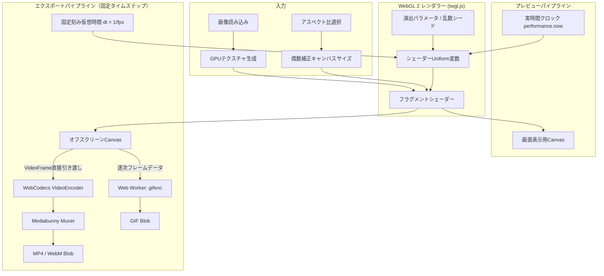
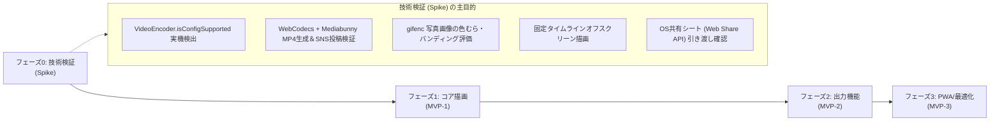

# App Reveal Lab 要件定義書

| 項目 | 内容 |
|---|---|
| 文書バージョン | 0.4 |
| ステータス | 要件定義（最終確定版／実装着手正式承認） |
| 対象 | MVP |
| 想定プラットフォーム | PC・スマートフォン向けWebアプリ／PWA |
| 最終更新日 | 2026-09-17 |

---

## 改訂履歴

| バージョン | 更新日 | 主な変更内容 |
|---|---|---|
| 0.1 | 2026-08-30 | 初版作成（MVPスコープ・基本演出・出力要件の定義） |
| 0.2 | 2026-09-17 | 精査結果の反映（アスペクト比プリセット、WebCodecs、H.264偶数ピクセル、GIF上限見直し等） |
| 0.3 | 2026-09-17 | レビュー指摘の反映（Mediabunny採用、動的機能検出マトリクス、Web Share仕様適正化等） |
| 0.4 | 2026-09-17 | レビュー指摘（第2次）の全件反映：<br>・JSONスキーマの固定コーデック文字列を廃止し、実行時動的決定用の `codecPreference` へ変更<br>・GIF最大150フレーム制限の対象を「待機・保持を含む総出力時間」として計算式を明記<br>・WebCodecsエラー条件を「API未定義」「コーデック設定非対応」「設定値例外」に分離定義<br>・透過出力のMVPスコープをPNG・GIFに限定（WebMアルファ透過はブラウザ依存リスク回避のためPhase 2へ移動）<br>・PWA受入条件に「初回オンラインキャッシュ完了後」の前提条件を明文化<br>・WebGL制御ライブラリを `twgl.js` に正式確定、Mermaid図の記法クリーンアップ |

---

## 1. 概要

App Reveal Labは、1枚の画像を低解像度・モザイク状態から高解像度へ段階的に変化させる「プログレッシブ表示風」の画像トランジションを作成し、動画・アニメーション画像として出力できるWebアプリである。

本アプリにおける「プログレッシブ表示」は、ネットワーク上の画像読み込み過程そのものを再現するものではない。読み込み済み画像にWebGL 2／GLSLシェーダーエフェクトを適用し、意図した時間・順序・表現で画像が明瞭になる視覚演出をブラウザ内ローカル処理で生成する。

---

## 2. 背景と目的

### 2.1 背景

低解像度の像が徐々に明らかになる演出には、SNS投稿、ショート動画の導入、画像クイズ、ゲーム、プレゼンテーション、展示作品、Webサイトの演出など、幅広い用途がある。一方、既存の動画編集ソフトでは、同様の表現を作るために複数レイヤー、マスク、キーフレーム等の複雑な設定が必要となる。

### 2.2 目的

利用者が画像を選択し、出力サイズ（アスペクト比）や演出パターン、少数のパラメータを直感的に調整するだけで、プログレッシブ表示風トランジションを作成・確認・共有できる状態を実現する。

### 2.3 中心価値

> 画像を選ぶ、演出を調整する、結果を共有可能な形式で書き出す、という一連の操作をサーバーを介さずブラウザ内で完結させる。

---

## 3. 想定利用者

- SNS（TikTok, Instagram Reels, YouTube Shorts, X等）やチャットで短い画像演出を共有したい一般利用者・クリエイター
- Webサイトやプレゼンテーション用のトランジション素材を素早く試作したい制作者・デザイナー
- 画像クイズやゲームの演出素材を作りたいコンテンツ制作者
- WebGL／シェーダー表現をパラメータ調整しながら試したいテクニカルアート・ジェネラティブアート愛好者

---

## 4. 想定ユースケース

- SNS投稿・ショート動画（縦型 9:16、正方形 1:1、横型 16:9）の導入アイキャッチ演出
- LINEやチャットツールで共有する短いループアニメーション（GIF）
- 「何が写っているか」を段階的に見せる画像クイズ・告知演出
- ゲームの画像アンロック・解析完了・データロード演出
- プレゼンテーションや展示作品のトランジション素材作成
- Webサイトで利用する軽量動画素材（WebM / MP4）の作成

---

## 5. MVPのスコープ

### 5.1 MVPに含める機能

- 画像の読み込み（JPEG / PNG / WebP）
- 出力キャンバスのアスペクト比設定（元画像、9:16、1:1、16:9、4:5）
- 画像配置の調整（`contain` / `cover`、位置パン、余白背景色）
- 透過背景の指定（MVPではPNGおよびGIF出力時のみ有効）
- WebGL 2／GLSLによるリアルタイム描画（GPUテクスチャ処理）
- 6種類の基本演出
- 演出パラメータの調整（時間、イージング、境界ぼかし、ブロックサイズ等）
- 再生、一時停止、先頭移動、シーク、ループ、全画面表示
- 固定タイムラインによる成果物生成（MP4, GIF, WebM, PNG）
- WebCodecs + Mediabunny による動画エンコード・多重化
- 動的機能検出（`VideoEncoder.isConfigSupported()`）に基づく利用可能形式の提示
- Web Share API対応（OS共有シートへのファイル引き渡し）
- 出力前のサイズ・時間・負荷に関する警告と制限（総時間に基づくGIF最大150フレーム制限等）
- プリセット保存（IndexedDB）
- 設定JSONのエクスポート／インポート
- 完全なブラウザ内ローカル処理（元画像・成果物を外部サーバーへ一切送信しない）
- レスポンシブUI対応（PC／スマートフォン両対応）
- PWA対応およびオフライン利用（初回キャッシュ完了後）

### 5.2 MVPに含めない機能

- 複数画像や動画を並べるタイムライン・トラック編集
- 音声・効果音の編集（BGM付与等）
- テキストや図形、ウォーターマークのオーバーレイ合成
- WebMでのアルファチャンネル付き（透過）動画出力（Phase 2へ移動）
- ユーザーアカウント登録、クラウド保存、共有URL発行
- 複数端末間のリアルタイム同期
- ジャイロ、マイク音声、カメラ等とのリアルタイム連動
- 高度な動画編集、カット編集、トランジション連結
- サーバーサイドレンダリング

---

## 6. 機能要件

### 6.1 画像入力・キャンバス設定

#### FR-IMG-01 対応画像形式
- JPEG
- PNG
- WebP

#### FR-IMG-02 入力方法
- ファイル選択ダイアログ
- ドラッグ＆ドロップ（PC推奨）
- クリップボードからの画像貼り付け（Paste）
- アプリ内サンプル画像の選択（初回テスト用）

#### FR-IMG-03 出力アスペクト比と配置補正
- **出力アスペクト比プリセット**:
  - `元画像準拠` (Original)
  - `9:16` (TikTok / Instagram Reels / YouTube Shorts)
  - `1:1` (Instagram フィード / アイコン)
  - `16:9` (横型動画 / YouTube / X)
  - `4:5` (Instagram ポートレート)
- **フィット方式**:
  - `contain`（全体表示）：キャンバス内に画像全体を収め、余白部分には指定の背景色（既定: 黒 `#000000` または任意色）を適用する。
  - `cover`（全画面フィット）：キャンバス全体を画像で満たし、はみ出た部分はトリミングする。
- **配置調整**: `cover` 使用時は、切り抜く中心位置（X/Yオフセット）をドラッグまたはスライダーで調整可能とする。
- **透明背景の形式別制約**:
  - 透過背景の指定は、アルファチャンネルに対応した **PNG** および **GIF** 出力時のみ有効とする。
  - **MP4** および **WebM**（MVP時）は動画コーデック・ブラウザ互換性の観点から透明度を保持せず、自動的に背景色（不透明）を合成して出力する。
- **EXIF Orientation補正**: 撮影時の向き情報を読み取り、自動で正しい回転方向に補正する。

#### FR-IMG-04 入力時の安全策
- 非対応形式、破損ファイル、読み込み失敗時に分かりやすいエラーメッセージを表示する。
- 巨大画像（長辺4096px超など）は、GPUメモリ消費を抑えるため読み込み時に適切な作業解像度に自動リサイズするか警告する。
- 利用者の入力画像を外部サーバーへ一切送信しない。

---

### 6.2 WebGL描画

#### FR-GL-01 描画方式（WebGL 2専任）
- 描画エンジンは **WebGL 2 (GLSL ES 3.00)** を必須とし、ライブラリには **twgl.js** を採用する。
- フルスクリーンクアッドに対してフラグメントシェーダーを適用し、元画像テクスチャ、モザイク計算、進行マスク、境界グラデーション、ブロックノイズをGPU上で合成する。
- 画像を再読み込み・再生成するのではなく、単一テクスチャのサンプリング座標計算（UV量子化・近傍サンプリング）と合成ブレンドによって解像状態をリアルタイム制御する。

#### FR-GL-02 描画の再現性
- 経過時間、正規化進行率（0.0〜1.0）、イージング関数、乱数シードから各フレームの描画状態を完全に決定論的に算出する。
- ランダム系演出は、同一のシード値と設定値から常に同一の描画結果を再現できる。
- プレビューと出力（エクスポート）で同一のシェーダープログラムおよび計算式を使用する。

#### FR-GL-03 座標とアスペクト比補正
- 円形マスク等の幾何学演出は、出力キャンバスのアスペクト比をユニフォーム変数としてシェーダーに渡し、縦長・横長キャンバスでも意図せず楕円にならないよう正円補正を行う。
- 演出位置や境界幅は、ピクセル単位ではなく正規化座標（0.0〜1.0）またはアスペクト比補正済みUV空間を基準として計算する。

#### FR-GL-04 障害対応と動作環境割り切り
- WebGLコンテキスト消失（`webglcontextlost`）を検知し、復旧時（`webglcontextrestored`）にテクスチャ・シェーダー・バッファを自動再生成して編集状態を復元する。
- **WebGL 2非対応環境への対応**:
  - WebGL 2が使用できない端末に対しては、サポート外である旨を明示する。
  - 描画速度・品質・保守性の観点から、**Canvas 2Dによるエフェクトフォールバックは実装しない**。

---

### 6.3 演出モード

| ID | モード名 | 概要・視覚効果 |
|---|---|---|
| **FR-FX-01** | **中心から外側へ (Radial Out)** | 中心から外側へ同心円状に高解像度領域が拡大。境界ぼかしにより滑らかなフォーカスイン効果。 |
| **FR-FX-02** | **外側から中心へ (Radial In)** | 画面外周から中心の被写体へ向けて高解像度化が収束。被写体を最後まで焦らす演出。 |
| **FR-FX-03** | **上から下へ (Linear Scan)** | 画面上部から下部へスキャンライン状に高解像度化。Web画像の古典的プログレッシブ描画を想起。 |
| **FR-FX-04** | **ブロックノイズスキャン (Block Scan)** | グリッド状に行単位で解像。境界付近に高解像度ブロックがランダムに先行出現するデジタルノイズ感。 |
| **FR-FX-05** | **ランダムブロック (Random Reveal)** | 画面全体をグリッド分割し、シード付き乱数順にブロックが個別に高解像度化。モザイクがパズル状に解ける演出。 |
| **FR-FX-06** | **多段階解像度 (Multi-Step LOD)** | 画像全体のモザイクが、超粗い状態から徐々に細かくなり、最後に元画像へシームレスに到達する演出。 |

---

### 6.4 調整パラメータ

#### 共通パラメータ
- **演出時間 (Duration)**: 1.0秒 〜 10.0秒（初期値: 3.0秒）
- **開始待機時間 (Start Delay)**: 0.0秒 〜 3.0秒（初期値: 0.5秒）
- **完成保持時間 (Hold Time)**: 0.0秒 〜 3.0秒（初期値: 1.0秒）
- **開始時モザイクサイズ**: 画面長辺に対する比率（粗さ）
- **終了時モザイクサイズ**: 最小値（元画像解像度 = 1px相当）
- **境界ぼかし幅 (Feather)**: 0.0（シャープ）〜 1.0（広域ぼかし）
- **イージング**: Linear, Ease-In, Ease-Out, Ease-In-Out, Cubic
- **ループ再生**: ON / OFF

#### ブロック系パラメータ（FR-FX-04, FR-FX-05）
- **グリッド分割数**: 横・縦のブロック数（例: 8x8, 16x16, 32x32, 64x64）
- **ブロック縦横比**: 正方形固定、またはキャンバス比率追従
- **ノイズ強度 / 先行表示率**: 境界より前方に解像ブロックが飛び出る確率
- **ランダムシード**: 整数値（シード変更ボタンでワンタップ更新可能）

#### 多段階解像度パラメータ（FR-FX-06）
- **段階数 (Steps)**: 3 〜 8段階
- **変化方式**: 階段状（Stepped）／ 連続フェード（Smooth）
- **各段階の保持比率**: 均等、または後半を長くするカーブ設定

#### パラメータUI
- 選択中の演出モードに関連するパラメータのみを動的に表示する。
- 「初期値に戻す（Reset）」ボタンを各演出ごとに配置。
- スライダー操作時にプレビューへ即時反映（シークバー位置に応じた描画更新）。

---

### 6.5 再生・プレビュー

- **操作機能**:
  - 再生 / 一時停止（トグルボタンおよびスペースキー）
  - 先頭へ戻る（Rewind）
  - ループ再生の有効/無効
  - シークバーによる任意時刻（タイムスタンプ）のスクラブ確認
  - 現在再生時間 / 総演出時間の表示（例: `01.2s / 04.5s`）
  - プレビュー全画面表示（フルスクリーン）
- **時間同期設計**:
  - プレビューの進行はフレーム数依存ではなく実時間経過（`performance.now()`）に基づき、推奨環境で30fps以上の描画更新を目標とする。描画遅延が生じた場合も演出全体の所要時間は経過時間に追従する。
  - 設定変更時は即座に現在シーク位置で再描画される。
  - 演出終了時点（および完成保持時間）において、最終フレームが完全な元画像高解像度状態となることを保証する。

---

### 6.6 出力（エクスポート）

#### 6.6.1 出力形式の位置付けと機能検出マトリクス

ブラウザ名による一律判定ではなく、起動時および出力時に `VideoEncoder.isConfigSupported()` による動的機能検出を行い、利用可能な形式のみを提示する。

| 動的検出結果 | 提供する出力形式 | 備考 |
|---|---|---|
| **H.264 エンコード対応** (`isConfigSupported` が true) | **MP4**（優先推奨）、GIF、PNG | SNS共有の標準形式。ハードウェア支援を優先。 |
| **VP8 / VP9 のみ対応** | **WebM**（優先推奨）、GIF、PNG | MP4非対応環境（一部ブラウザ）向けの高画質形式。 |
| **VideoEncoder 非対応** | **GIF**、**PNG** | 動画エンコード不可環境向け。動画が必要な場合は対応ブラウザを案内。 |

- **共有導線の判定**:
  - `navigator.canShare({ files })` が true の環境：**OSの共有シート**を呼び出す。
  - false またはユーザーキャンセル時：通常の**ファイルダウンロード（保存）**を案内。

#### 6.6.2 アスペクト比別解像度寸法定義

出力設定における「720p相当」「1080p相当」の具体的なピクセル寸法は、アスペクト比ごとに以下のように定義する。
ビデオコーデック（H.264等）の仕様に準拠するため、**幅・高さはいずれも偶数（2の倍数）**とする。

| アスペクト比プリセット | 720p相当（幅 × 高さ） | 1080p相当（幅 × 高さ） |
|---|---|---|
| **16:9** (横型 / YouTube / X) | 1280 × 720 | 1920 × 1080 |
| **9:16** (縦型 / Shorts / Reels) | 720 × 1280 | 1080 × 1920 |
| **1:1** (正方形 / Instagram) | 720 × 720 | 1080 × 1080 |
| **4:5** (ポートレート) | 720 × 900 | 1080 × 1350 |
| **元画像準拠** (Original) | 短辺が720pxになるよう比率維持（偶数補正） | 短辺が1080pxになるよう比率維持（偶数補正） |

#### FR-OUT-01 共通出力仕様
- **出力解像度**: 上記寸法表から選択（または偶数補正されたカスタム値）。
- **フレームレート (fps)**: 15, 24, 30, 60 fps から選択（形式に応じた推奨値を初期選択）。
- **推定ファイルサイズ表示**: 設定値（解像度・時間・fps）から概算ファイルサイズを事前提示。
- **進捗とキャンセル**: レンダリング中はパーセンテージプログレスバー、経過時間を表示し、キャンセル操作後1秒以内に操作可能状態へ復帰する。
- **出力結果プレビュー**: 生成完了後、モーダル内で再生確認およびファイルサイズ確認が可能。
- **保存・共有フロー**:
  - `navigator.canShare({ files })` が true の環境ではOS共有シートへ引き渡す。共有先として写真アプリ等が表示されるかはOS・端末に依存する。
  - 共有シート非対応または共有不可時は、ファイルダウンロード（`a[download]`）を提示する。

#### FR-OUT-02 MP4出力（WebCodecs + Mediabunny）
- **エンコードパイプライン**:
  - 選択した幅・高さ・fps・ビットレートに応じた適切なAVC Level（例: 720p@30fpsなら `avc1.42001f`、1080p@30fpsなら `avc1.4d0028` 等）を実行時に組み立て、`VideoEncoder.isConfigSupported()` を実行する。
  - 明示的な `readPixels()` を避け、GPU上のCanvasから `new VideoFrame(canvas, { timestamp })` への直接引き渡し経路を優先する。
  - `Mediabunny` によりMP4コンテナへ多重化・ストリーム出力する。
- **音声トラック仕様**:
  - **MVP基本方針**: 映像トラックのみを出力する。
  - **Spike検証連携**: Spikeにおいて主要SNS（Instagram, TikTok, X, LINE）へのアップロード互換性を検証し、無音トラック欠落による不具合（ループ再生不可・静止画誤認識等）が確認された場合のみ、無音AACトラックを多重化する設計とする。
- **初期値**: 720p相当、30fps、ビットレート5〜8Mbps。

#### FR-OUT-03 GIF出力（最適化ストリーミング方式）
- **エンコードパイプライン**:
  - メインスレッドの応答性を保つため、**Web Worker** 内で `gifenc` を用いてエンコードを実行する。
  - 全フレームのRGBA生データを同時にメモリ保持せず、描画フレームごとに逐次パレット量子化・書き込みを行う。
- **上限値と総出力時間計算ルール**:
  - **最大フレーム数を 150 フレーム** とし、待機・保持を含む総出力時間に対して制限を適用する：
    $$\text{総時間} = \text{開始待機時間} + \text{演出時間} + \text{完成保持時間}$$
    $$\text{総フレーム数} = \lceil \text{総時間} \times \text{fps} \rceil \le 150$$
    - 15fps: 総時間最大 10.0秒
    - 30fps: 総時間最大 5.0秒
    - 上限を超える指定があった場合は、時間またはfpsの自動調整を画面上で促す。
- **初期値**: 480px相当、15fps、無限ループ。
- **画質・バンディングへの配慮**:
  - `gifenc` はディザリング未対応のため、写真素材における色むら・バンディング（トーンジャンプ）のリスクをSpikeで評価する。

#### FR-OUT-04 WebM出力
- 選択した解像度・fpsに応じたVP9/VP8設定を組み立てて `VideoEncoder.isConfigSupported()` を確認し、`Mediabunny` によりWebMコンテナへ多重化。
- 初期値: 720p相当、30fps。

#### FR-OUT-05 固定タイムラインレンダリング（Fixed-Timestep）
- 出力処理時は実時間描画（`requestAnimationFrame`）を行わず、fpsに応じた固定刻み幅（`dt = 1 / fps`）で仮想時刻を進め、フレームごとにオフスクリーンCanvasへ描画してエンコーダーへ渡す。
- これにより、端末の処理速度に関わらず成果物のフレーム欠落（ドロップフレーム）を防止し、指定時間と成果物の総再生時間の差を1フレーム以内に収める。

---

### 6.7 プリセット・設定保存

- **ローカルプリセット管理**:
  - 現在の演出パラメータ、キャンバス設定、色設定を名前付きプリセットとしてブラウザローカル（IndexedDB）に保存・呼び出し・上書き・削除できる。
  - 初期組み込みプリセット（SNSショート用、シネマティックスキャン、レトロLOD等）を提供する。
- **設定JSONのエクスポート／インポート**:
  - プリセット設定を `.json` ファイルとしてダウンロードおよび読み込み可能。
  - JSONにはフォーマットのバージョン番号（`schemaVersion: 1`）を含め、将来の拡張時も後方互換性を保つ。
  - **重要**: プライバシー保護と容量肥大化防止のため、**元画像データはJSONに含めない**。

---

### 6.8 PWA・オフライン対応

- **Service Workerによるオフライン化**:
  - アプリ本体（HTML/CSS/JS）、シェーダーコード、ライブラリ、サンプル画像をキャッシュする。
  - アプリに必要なすべての依存リソース（スクリプト、スタイル、フォント等）はCDN等の外部URLに依存せずアプリ内に同梱（バンドル）し、完全オフライン状態で起動・編集・出力を完結できる。
- **更新通知**: 新バージョン検出時は作業を妨げないトースト通知を表示する。

---

## 7. UI／UX要件

### 7.1 基本レイアウト設計
- **2ペイン構成（PC/タブレット）**:
  - 左側（中央）: キャンバスプレビュー、再生コントロールバー。
  - 右側（サイドバー）: 画像入力・アスペクト比選択、演出モードタブ、パラメータ調整、エクスポートパネル。
- **1ペイン縦スクロール構成（スマートフォン）**:
  - 画面上部: プレビュー領域（固定表示または上部優先）。
  - 画面下部: タブで整理された設定パネルおよびエクスポートボタン。

### 7.2 操作性・UX方針
- **3ステップ出力**: 「画像を選ぶ」→「比率/演出を選ぶ」→「出力ボタンを押す」の最短操作で成果物を生成可能。
- **即時スクラブ反映**: シークバーの操作に追従してエフェクト状態を即座にプレビュー更新。
- **非破壊編集**: 画像や演出を切り替えても直前のパラメータを保持。

### 7.3 アクセシビリティ・視覚配慮
- Spaceキーによる再生/一時停止、矢印キーによるシーク等に対応。
- `prefers-reduced-motion` 設定時はUIアニメーションを抑制。
- 高周波点滅を初期値とせず、マイルドな輝度変化を維持。

---

## 8. 非機能要件

### 8.1 パフォーマンス目標
- **プレビュー描画**: 推奨端末において常時 30fps 以上の描画更新を目標とする。
- **応答性**: エンコード処理中もUIの進捗表示が更新され、キャンセル操作へ応答すること。
- **メモリ安定性**: 連続出力後も不要なリソース（テクスチャ、Blob URL等）を解放し、ブラウザタブのメモリ肥大化を防止すること。

### 8.2 セキュリティ・プライバシー
- 利用者の画像および生成物は端末内でのみ処理し、外部サーバーへの送信を行わない。
- 外部CDNからの動的コード読み込みを排除し、サプライチェーンリスクを低減する。

### 8.3 動作環境
- Chrome, Safari (macOS / iOS), Edge, Firefox の最新メジャーバージョン。
- 実際の利用可能機能（MP4/WebM/GIF）は動的機能検出（`VideoEncoder.isConfigSupported()`）の結果に従う。

---

## 9. 技術仕様・実装アーキテクチャ

### 9.1 確定技術スタック

| 分類 | 採用技術 / ライブラリ | 選定理由 |
|---|---|---|
| **言語 / ビルド** | **TypeScript + Vite** | 型安全性、高速ビルド、軽量な成果物。 |
| **UIフレームワーク** | **Svelte 5 (Vite)** | 仮想DOMオーバーヘッドがなく軽量。WebGL Canvasの直接制御や状態更新の追従性に優れる。 |
| **WebGL制御** | **twgl.js** | フルスクリーンの2Dシェーダー描画に最適化。ボイラープレートを大幅削減しつつオーバーヘッドを最小化。 |
| **動画多重化** | **Mediabunny** | mp4-muxer/webm-muxerの後継統一ライブラリ。WebCodecs連携・ストリーミング多重化に対応。 |
| **GIFエンコード** | **gifenc** (Web Worker) | 高速なパレット量子化に対応した軽量GIFライブラリ。 |
| **ストレージ** | **idb-keyval** | IndexedDBへのプリセット保存用ラッパー。 |
| **CSS** | **Tailwind CSS** | レスポンシブUIの迅速な構築。 |

### 9.2 レンダリング＆エクスポートパイプライン



---

## 10. データ構造仕様

### 10.1 設定プリセット形式 (Preset JSON Schema v1)

```typescript
interface AppRevealPreset {
  schemaVersion: 1;
  id: string;
  name: string;
  createdAt: string; // ISO 8601
  updatedAt: string;
  canvas: {
    aspectRatio: "original" | "9:16" | "1:1" | "16:9" | "4:5";
    fit: "contain" | "cover";
    positionOffset: { x: number; y: number }; // -1.0 ~ 1.0
    backgroundColor: string; // HEXカラー (#000000)
    transparent: boolean; // PNG / GIF 出力時のみ有効
  };
  animation: {
    mode: "radial_out" | "radial_in" | "linear_scan" | "block_scan" | "random_reveal" | "multi_step_lod";
    duration: number; // 秒
    startDelay: number;
    holdTime: number;
    easing: "linear" | "easeIn" | "easeOut" | "easeInOut" | "cubic";
    loop: boolean;
    seed: number;
    feather: number;
    gridSize?: { x: number; y: number };
    noiseStrength?: number;
    lodSteps?: number;
    lodSmooth?: boolean;
  };
  exportSettings: {
    resolutionPreset: "720p" | "1080p" | "custom";
    customResolution?: { width: number; height: number }; // 偶数ピクセル
    fps: 15 | 24 | 30 | 60;
    format: "mp4" | "gif" | "webm" | "png";
    bitrate?: number; // bps (例: 5_000_000)
    codecPreference?: "auto" | "h264" | "vp9" | "vp8"; // 固定Levelではなく実行時に判定
    qualityPreset?: "standard" | "high";
    gifQuality?: number;
  };
}
```

---

## 11. エラー・警告仕様

| エラー種別 | 検出条件 | ユーザーへの通知内容 | 回復アクション |
|---|---|---|---|
| **画像破損/非対応** | デコード失敗、非対応拡張子 | 「この画像形式はサポートされていないか、ファイルが破損しています。」 | 別画像の選択を促す |
| **WebGL 2非対応** | WebGL 2コンテキスト取得失敗 | 「お使いのブラウザはWebGL 2に対応していません。」 | 最新のChrome / Safariの利用を案内 |
| **コンテキスト喪失** | `webglcontextlost` イベント発生 | 「グラフィック処理が中断されました。再読み込み中...」 | 自動リソース再構築を実行 |
| **VideoEncoder未サポート** | `typeof VideoEncoder === "undefined"` | 「お使いのブラウザは動画エンコード機能に対応していません。」 | GIF出力への切り替え、または対応ブラウザ案内 |
| **コーデック設定非対応** | `isConfigSupported(config)` の結果 `supported === false` | 「指定された解像度またはフレームレートの動画出力に対応していません。」 | 解像度やfpsを下げるか別形式への切り替えを案内 |
| **エンコード設定値不正** | `isConfigSupported()` が例外をスロー | 「動画出力パラメータが無効です。」 | 初期値へのリセットを促す |
| **GIF総フレーム超過警告** | 総フレーム数（待機+演出+保持） > 150 | 「GIFは総時間10秒(15fps)または5秒(30fps)以内（最大150フレーム）に制限されています。」 | 時間またはfpsの自動調整ボタン提示 |
| **エンコード処理例外** | メモリ枯渇・パイプライン中断 | 「処理中にエラーが発生しました。設定を下げて再試行してください。」 | 解像度またはfpsを下げて再試行を案内 |

---

## 12. 受入条件（Acceptance Criteria）

### 12.1 描画・演出機能
- [ ] JPEG / PNG / WebP画像を正しく読み込み、EXIFの向きが自動補正されること。
- [ ] 出力アスペクト比（元画像、9:16、1:1、16:9、4:5）およびフィット方式（contain/cover）が即座に反映されること。
- [ ] 定義された6種類すべての演出モードがプレビュー上で動作し、推奨環境で30fps以上を目標として描画更新されること。
- [ ] 演出パラメータや乱数シードを変更した際、即座にプレビューが更新されること。
- [ ] アスペクト比補正により、縦長・横長キャンバスでも円形マスクが正円を維持すること。

### 12.2 再生制御
- [ ] 再生、一時停止、先頭移動、シーク、ループが正しく機能すること。
- [ ] 演出全体の所要時間と設定時間との差が実時間基準で許容範囲内であること。
- [ ] 演出完了後、保持時間を経て最終フレームが完全な元画像高解像度状態で停止/ループすること。

### 12.3 出力機能
- [ ] `VideoEncoder.isConfigSupported()` が true を返した設定で、MP4（またはWebM）が固定タイムライン方式で生成され、指定総再生時間との差が1フレーム以内であること。
- [ ] 出力動画の解像度が偶数ピクセル（2の倍数）に維持され、一般的なプレイヤーで正常に再生可能であること。
- [ ] GIF出力において、待機・保持を含む総フレーム数が最大150フレームに制限され、Web Worker上で処理中も進捗バーが表示されること。
- [ ] 生成処理中に「キャンセル」を押した場合、1秒以内に処理が中断され、操作可能状態へ戻ること。
- [ ] `navigator.canShare({ files })` が true の環境では生成ファイルをOSの共有シートへ渡せること（写真アプリ等の表示可否はOSに依存）。共有できない環境ではダウンロードリンクが提示されること。

### 12.4 データ・オフライン
- [ ] プリセットをIndexedDBに保存し、次回起動時も正しく呼び出せること。
- [ ] 設定JSONのエクスポートおよびインポートがスキーマバージョンを考慮して正常に行えること。
- [ ] **初回オンライン起動およびオフライン用リソースのキャッシュ完了後**、ネットワーク切断（機内モード）状態でもアプリの起動、編集、プレビュー、動画出力が完結すること。

---

## 13. テスト観点

### 13.1 機能・描画テスト
- 各種アスペクト比（極端な横長、極端な縦長、正方形）の入力画像での表示検証
- 全6演出モードにおけるパラメータ境界値（最小値・最大値）の動作検証
- 乱数シードの同一値による描画完全一致の検証
- 高DPI環境での描画ぼやけの有無

### 13.2 エクスポート・互換性テスト
- iPhone（iOS Safari）および Android（Chrome）実機における `isConfigSupported` 検出とMP4生成
- OS共有シートへの引き渡しとファイル保存の挙動確認
- PC主要ブラウザ（Chrome, Edge, Safari, Firefox）での出力テスト
- 生成されたMP4を主要SNS（X, Instagram, TikTok, LINE）にアップロードし、再生・ループ挙動・無音トラック影響の有無を検証

### 13.3 負荷・エッジケーステスト
- 大解像度画像（4K等）入力時の安定性
- 連続エクスポート時のメモリリーク確認（DevTools Memoryプロファイラ）
- エンコード処理中のキャンセル操作への応答性検証

---

## 14. 開発ロードマップ案



| フェーズ | 開発期間目安 | 主要実装項目 |
|---|---|---|
| **フェーズ0: 技術検証 (Spike)** | 2〜3日 | ・実機での `isConfigSupported` 判定と WebCodecs + Mediabunny のMP4生成動作確認<br>・生成MP4の主要SNS（Instagram, TikTok, X, LINE）投稿・無音トラック影響検証<br>・`gifenc` の写真画像における色むら・バンディング評価（グローバル vs フレーム別パレット、必要に応じたディザリング検討）<br>・固定タイムラインオフスクリーン描画の実機処理時間・メモリ計測<br>・OS共有シート（Web Share API）引き渡し確認 |
| **フェーズ1: コア描画 (MVP-1)** | 1週間 | ・画像読み込み、EXIF補正、アスペクト比プリセット・偶数ピクセル計算<br>・Svelte 5 + twgl.js によるWebGL 2描画基盤、6種類のシェーダー演出実装<br>・シーク・再生コントロールバー、PNG保存 |
| **フェーズ2: 出力機能 (MVP-2)** | 1週間 | ・WebCodecs + Mediabunny によるMP4 / WebMエクスポートパイプライン<br>・Web WorkerでのGIFストリーミング生成（最大150フレーム制限）<br>・進捗UI、キャンセル機能、Web Share API / ダウンロードフォールバック |
| **フェーズ3: 仕上げ (MVP-3)** | 3〜5日 | ・プリセット管理（IndexedDB / idb-keyval）、JSONインポート/エクスポート<br>・PWA設定、オフラインキャッシュ、コンテキスト消失復旧<br>・実機チューニング、エラーハンドリング |

---

## 15. 将来拡張（Phase 2以降の候補）

- **WebMアルファチャンネル透過出力**: VP9等でのアルファ付きWebM動画出力
- **無音AAC以外の音声機能**: BGMや効果音（SE）の合成・同期編集
- **アニメーションWebP出力**: GIFより高画質・小容量なアニメーション画像形式の追加
- **演出の拡充**:
  - グリッチ、RGBずらし、走査線、CRT風ノイズ
  - 斜めスキャン、任意角度スキャン
  - タップした座標から波紋状に広がるインタラクティブ演出
  - 複数箇所からの同時解像
- **ソーシャル・外部連携**:
  - 画像クイズ用テンプレート（正解発表アニメーション）
  - Webサイト埋め込み用スクリプト/Web Components出力
